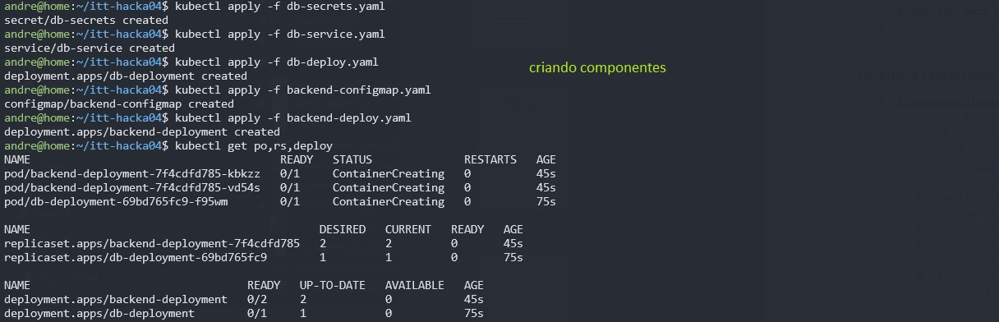
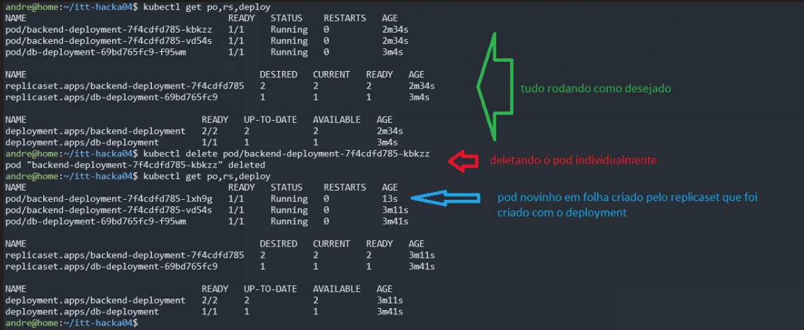

# IT TALENT – TURMA DEVOPS 2024 – 4º HACKATHON – Pt. 1

### 1. Kubernetes (Orquestração de Containers):
    
- a. Para essa atividade, iremos criar um ReplicaSet com 1 instância do Banco de Dados e 2 do backend, usando os repositórios:
    - i. Projeto de Banco de Dados: moisesAlc/Banco-IT_Talent (github.com)
    - ii. Projeto de backend: moisesAlc/Backend-IT_Talent (github.com).
- b. Você irá criar um repositório no Github onde subirá o(s) arquivo(s) .yaml necessários para a criação desse ReplicaSet;
- c. Adicione ao repositório um print com a execução do ReplicaSet
- d. Adicione ao repositório um print com a exclusão de um dos pods do ReplicaSet
- e. Adicione ao repositório um novo print demonstrando a subida de um novo pod para a normalização do ReplicaSet, feita automaticamente pelo K8S

